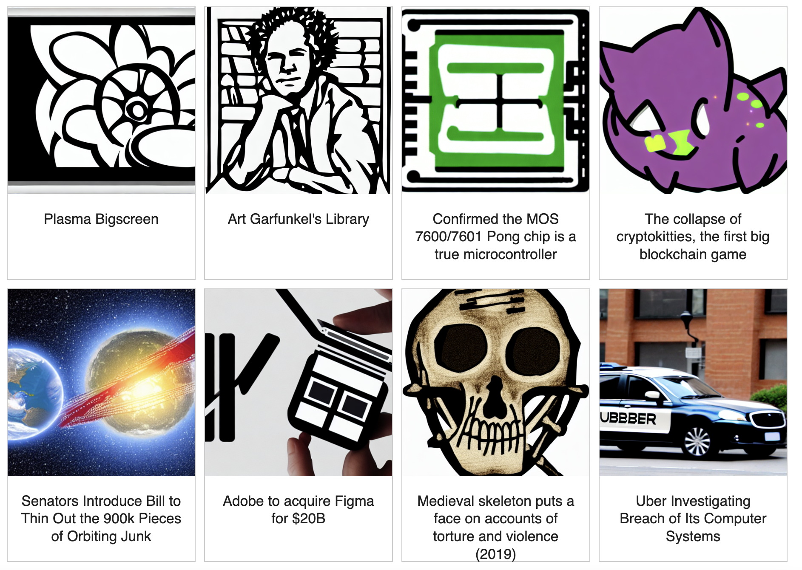
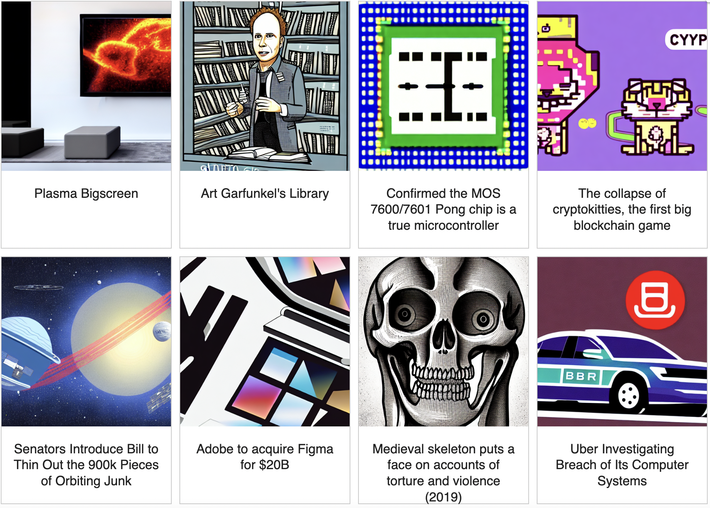
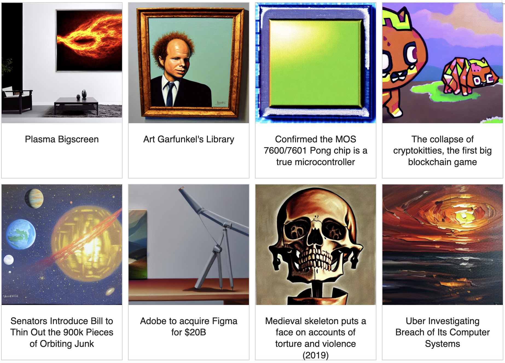

# Stable Diffusion News

Generate news article photo with Stable Diffusion.

A Jupyter notebook to 
1. Fetch titles and links of news articles from the selected news source.
2. Use Stable Diffusion to generate a photo for each article using title and style modifier of your choice.
3. Display gallery view with clickable links.

## Supported Sites
- Hacker News
- Reuters

## Samples
### Clipart style (Hacker News)

### Digital illustration style (Hacker News)

### Oil painting style (Hacker News)

